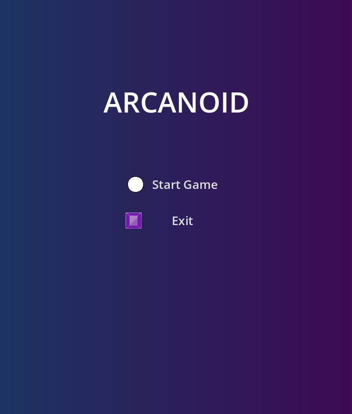
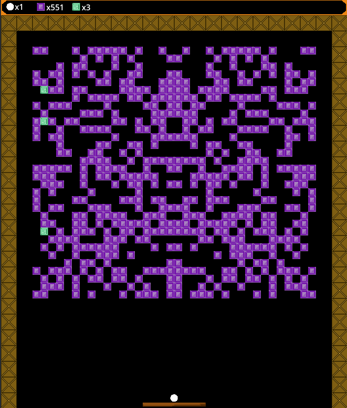
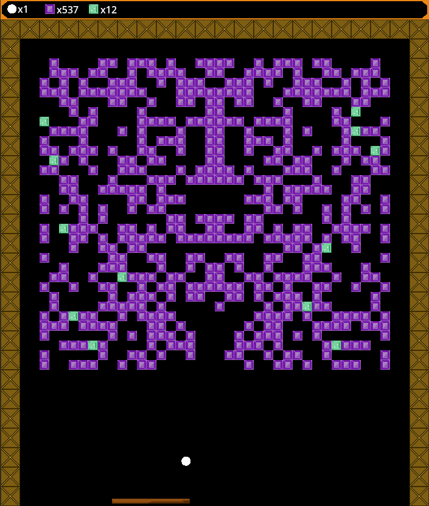
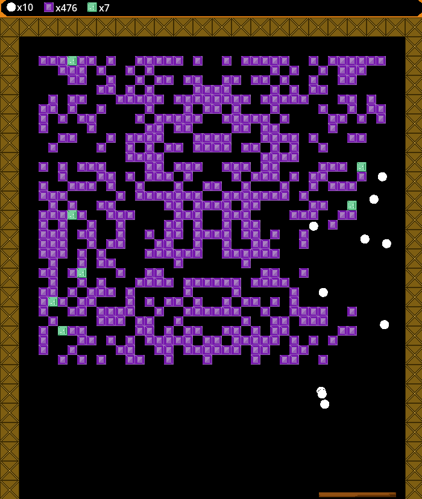
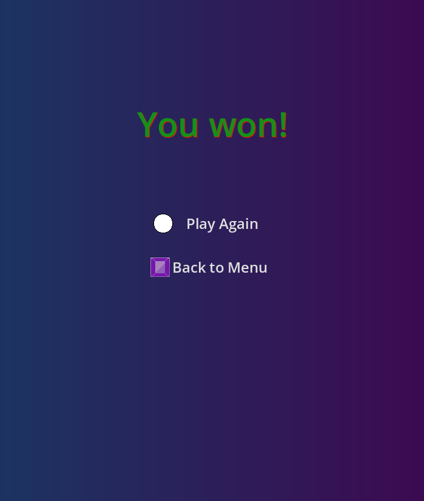
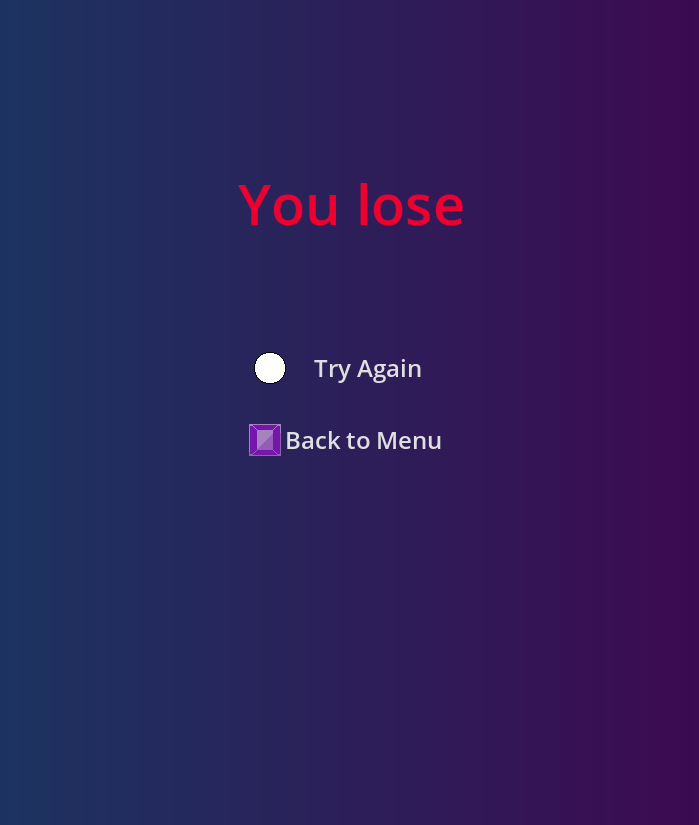

# 💎 Procedural Breaker (Godot 4.5)

A physics-driven arcade brick-breaker game built with **Godot Engine 4.5**. Unlike my previous Endless Runner project, this game focuses on **closed-environment physics**, **bouncing mechanics**, and **procedural level generation**.

Every playthrough offers a unique challenge as the level layout is automatically generated and mirrored, ensuring no two games are exactly the same.

  

## 🎮 Key Features

- **Procedural Level Generation:** The game utilizes a grid-based spawner that creates unique, symmetrical patterns of stones every time you play.
- **Advanced Physics Bouncing:** The ball doesn't just bounce randomly; hitting different parts of the paddle changes the reflection angle, giving the player precise control over aiming.
- **"Sapphire" Chaos Mechanic:** Destroying blue Sapphire stones triggers a massive multi-ball event, spawning 3-12 new balls with randomized trajectories.
- **Global State Management:** Seamless transitions between Menu, Gameplay, Win, and Lose states.
- **Dynamic Difficulty:** You win by clearing the board, but you lose if you run out of balls.

  
  
  

## ⚙️ Technical Deep Dive

### 1. Procedural Generation (The Spawner)

Unlike classic Arkanoid with fixed levels, this project generates the map programmatically.

- **Grid System:** The board is divided into a 36x32 grid.
- **Symmetry:** The algorithm generates the left side of the map and automatically mirrors it to the right side to create pleasing, Rorschach-like patterns.
- **Randomness:** A randomized filter determines empty spaces vs. stone placements.

### 2. Physics & Control

The `Ball.gd` script uses `move_and_collide` for precise collision detection.

- **Paddle Interaction:** We calculate the `offset_x` (distance between the ball and the paddle center) to calculate a new vector. This allows the player to "steer" the ball by hitting it with the edge of the paddle.
- **Wall/Stone Interaction:** Uses standard physics reflection logic (`velocity.bounce(normal)`).

### 3. Object Hierarchy

- **Diamonds:** Standard static targets.
- **Sapphires:** Special `StaticBody2D` nodes that, upon destruction, instantiate copies of the ball (`duplicate()`) and rotate their velocity vectors to create a "firework" effect of new balls.

  
  

## 🛠️ Built With

- **Engine:** Godot 4.5
- **Language:** GDScript
- **Physics:** Godot 2D Physics Engine (Kinematic & Static Bodies)

## 🕹️ Controls

- **Left / Right Arrow (or A / D):** Move Paddle
- **Space / Enter:** Launch Ball / Start Game

## 🚀 How to Run

1.  Clone this repository.
2.  Import the project folder into **Godot Engine 4.5** (or newer).
3.  Run the project (`F5`).

---

_Created as an advanced study of Godot 4.x physics interactions and procedural algorithms._
